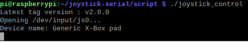
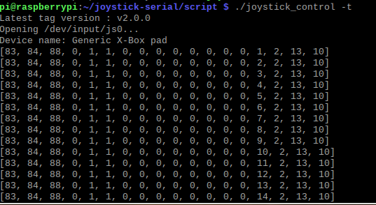
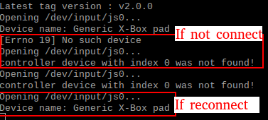
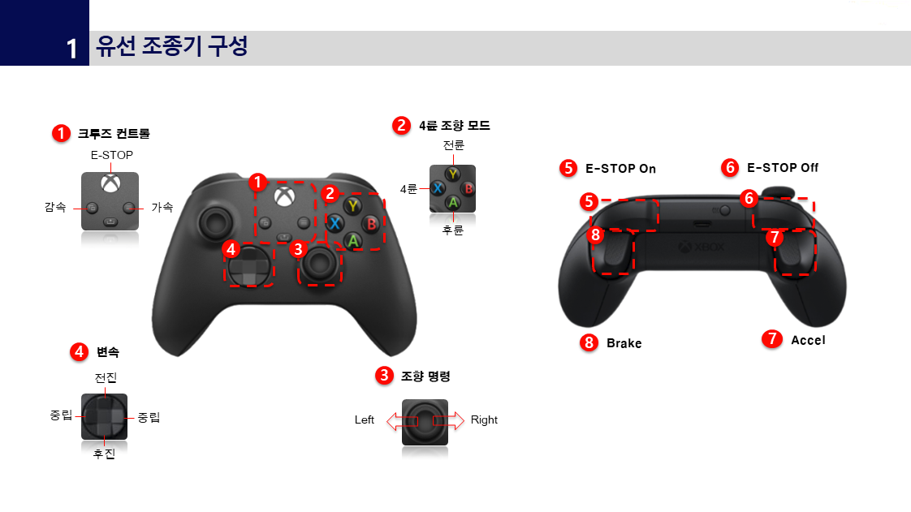
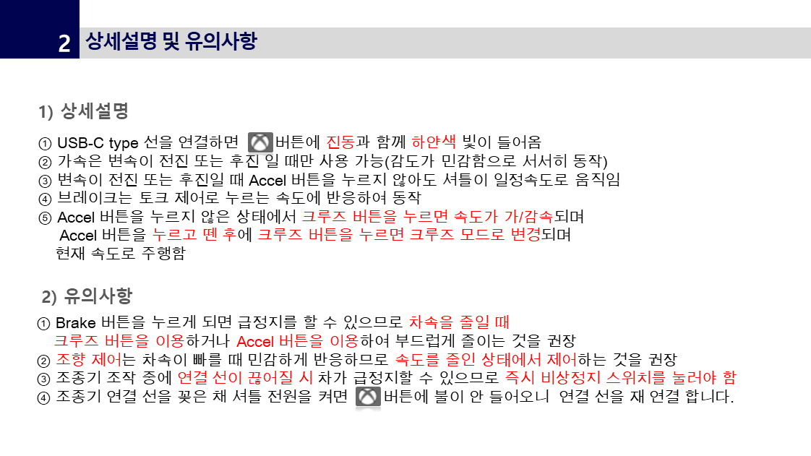

# joystick-serial

This package is for serial communication by connecting a joystick to the Raspberry Pi 3.

It is a package used to control the Unmmaned Solution Shuttle, With:US.

## Install

### Pip Install

~~~
$ pip install gitpython
~~~

## Run

~~~
$ cd script
$ ./joystick_control
~~~

If you only want to check the joystick data, Run it like this.

~~~
$ cd scirpt
$ ./joystick_control -t
~~~

## Example

- If the xbox controller is connected, it looks like this.

- If it is in test mode, it looks like this.

- If the xbox controller is disconnected and reconnected, it looks like this.

## Operation Manual

